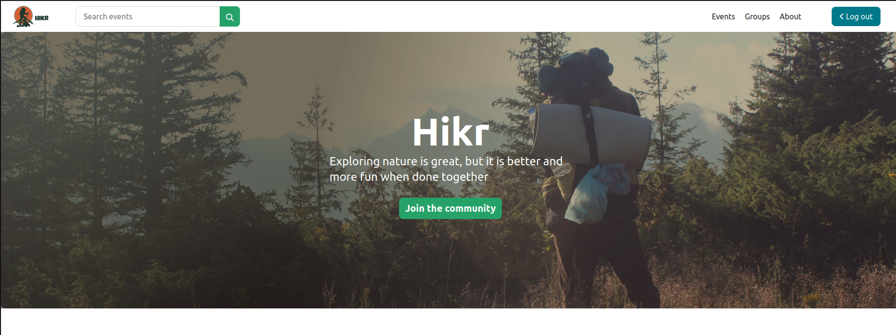

# Hikr ~ _Explore nature together!_
---
  


[Hikr](hikr.odocodes.tech) is a web application or platform for connecting people with the shared interest of hiking.

## Background Context
---
1. What is Hikr?
Exploring nature is great, but it is better and fun when done together. Having identified that there is a need to build a community of people with shared interests and safety as a concern, when it comes to outdoor activities like hiking. Developing a hiking application called Hikr came to mind. The Hikr app is here to connect hikers to fellow hikers so that they can link up and explore as one hiking tribe. Moreover, it is safer to venture outdoors together. Hence, Hikr makes it easy to connect, socialize and keep fit while in the safety of a community.

2. What not to expect from the Hikr application?
* A dating app where you find your soulmate.
* A social media app.
 
3. Target Audience
The Hikr app will mainly be for people who are into hiking, fitness as well as nature lovers but don't want to journey alone in the outdoor experience.

4. Location 
Hikr is relevant to East Africa for now. 

Checkout the live site [here](hikr.odocodes.tech).

## Tour of Hik
---
Here is a preview our depoyed version of Hikr.
  


Below is a preview of Hikr features.


## Installation

```sh
$ git clone https://github.com/evanceodoyo/Hikr.git
$ python3 -m venv venv
$ source venv/bin/activate
$ pip install -r requirements.txt
```

Create a new PostgreSQL database

```sh
 $ psql postgres
 $ CREATE DATABASE databasename
 $ \connect databasename
```

Set the environment variables and make migrations

```sh
$ python manage.py makemigrations
$ python manage.py migrate
```

Create a superuser

```sh
$ python manage.py createsuperuser
```

Start the development server

```sh
$ python manage.py runserver
```

### Populate the database with sample data
- To populate the database with sample data, ensure you are in folder with `manage.py`. If you have images you want to use for the events/groups, ensure they are in the same directory in folders named `event_images` and `group_images` respectively. You can find sample events and groups images in [this folder](https://drive.google.com/drive/folders/1e7oFwf6U5u1plsp12ZuGyTBxGwjVqaV3?usp=sharing).

- Once in the folder, run the script as follows:  
```sh
$ ./populate_db.py
```
or 
```sh
$ python3 populate_db.py
```

## Blog Posts
---
- [Evance Odoyo's](https://odoyoevance.medium.com/hikr-place-to-connect-and-explore-nature-together-4328b974644a) Blog
- [Stacy Gakiria's](https://medium.com/@swgakiria/hikr-the-application-where-interests-build-a-community-and-develop-friendships-fe8f356efcc2) Blog

## Authors
---
- [Evance Odoyo](https://github.com/evanceodoyo)
- [Stacy Gakiria](https://github.com/SKGakiria)

## License
---
[MIT](https://opensource.org/license/mit/) License.